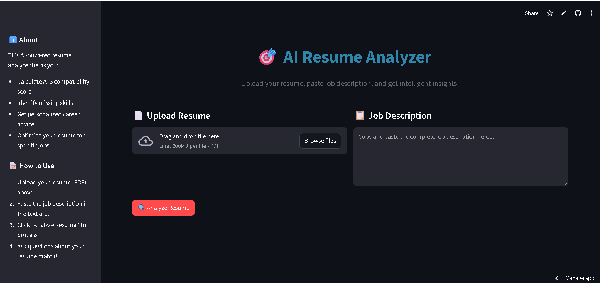

# 🎯 AI Resume Analyzer - Smart ATS Compatibility Checker
## 🚀 Live Demo: [Click Here](https://resumeai-harsh-pilania.streamlit.app/)
## 📱 Demo Video: [Click Here](https://drive.google.com/file/d/1ljlR4oXACE4up9_SBGwcSX9iRUVX1uZy/view?usp=sharing)



A powerful **AI-driven resume analysis tool** that helps job seekers optimize their resumes for specific job descriptions. Get instant ATS compatibility scores and personalized career insights through an interactive chat interface.


## ✨ Features

- 📄 **PDF Resume Upload** - Extract and analyze text from PDF resumes seamlessly
- 🎯 **ATS Compatibility Score** - Get precise match percentage using semantic similarity
- 💬 **Interactive AI Chat** - Ask specific questions about your resume analysis
- 🔍 **Smart Analysis** - Identify missing skills, strengths, and improvement areas
- ⚡ **Fast Processing** - Powered by Groq's high-speed LLM inference
- 🎨 **Modern UI** - Clean, responsive design with intuitive user experience
- 🧠 **Context-Aware** - Maintains conversation memory for better insights

## 🛠️ Tech Stack

- **Frontend**: Streamlit
- **LLM**: Groq (Llama-3.3-70B)
- **Embeddings**: OpenAI Embeddings
- **Vector Database**: FAISS
- **PDF Processing**: PyPDF2
- **Framework**: LangChain

## 📋 Prerequisites

Before running this application, make sure you have:

- Python 3.8 or higher
- OpenAI API key
- Groq API key

## 🔧 Installation

1. **Clone the repository**
   ```bash
   git clone https://github.com/your-username/ai-resume-analyzer.git
   cd ai-resume-analyzer
   ```

2. **Create a virtual environment**
   ```bash
   python -m venv venv
   source venv/bin/activate  # On Windows: venv\Scripts\activate
   ```

3. **Install dependencies**
   ```bash
   pip install -r requirements.txt
   ```

4. **Set up environment variables**
   
   Create a `.streamlit/secrets.toml` file in your project root:
   ```toml
   [secrets]
   OPENAI_API_KEY = "your_openai_api_key_here"
   GROQ_API_KEY = "your_groq_api_key_here"
   ```

## 🏃‍♂️ Running Locally

Start the Streamlit app:

```bash
streamlit run ATS.py
```

The app will open in your browser at `http://localhost:8501`

## 📊 How It Works

1. **PDF Processing**: Extract text content from uploaded resume PDF
2. **Text Analysis**: Process both resume and job description content
3. **Embedding Generation**: Convert documents to vector embeddings using OpenAI
4. **Similarity Calculation**: Compute ATS compatibility score using cosine similarity
5. **Vector Storage**: Store document chunks in FAISS vector database
6. **AI Chat**: Interactive Q&A powered by Groq's LLM with conversation memory
7. **Insights Generation**: Provide actionable recommendations and analysis

```
Resume PDF → Text Extraction → Embedding → Similarity Score → Vector Storage → AI Chat → Insights
```

## 🌐 Deployment

### Deploy to Streamlit Cloud

1. Push your code to GitHub
2. Go to [share.streamlit.io](https://share.streamlit.io)
3. Connect your GitHub repository
4. Add your API keys in the Streamlit Cloud secrets management:
   - `OPENAI_API_KEY`
   - `GROQ_API_KEY`
5. Deploy!

### Environment Variables for Deployment

Make sure to set these secrets in your deployment platform:
- `OPENAI_API_KEY`: Your OpenAI API key
- `GROQ_API_KEY`: Your Groq API key

## 📁 Project Structure

```
ai-resume-analyzer/
├── ATS.py                # Main Streamlit application
├── requirements.txt      # Python dependencies
├── .streamlit/
│   └── secrets.toml     # API keys (local development)
├── README.md            # Project documentation
└── .gitignore          # Git ignore file
```

## 🎨 Features in Detail

### Smart Resume Analysis
- Advanced PDF text extraction with error handling
- Semantic similarity using OpenAI embeddings
- Comprehensive ATS compatibility scoring
- Document caching for improved performance

### Interactive Chat Interface
- Modern messaging UI with user/bot conversation bubbles
- Conversation memory for context-aware responses
- Real-time AI-powered insights and recommendations
- Mobile-responsive design

### Sample Questions You Can Ask
- *"What are my key strengths for this role?"*
- *"Which skills am I missing?"*
- *"How can I improve my ATS score?"*
- *"What experience best matches the requirements?"*
- *"Suggest specific resume improvements"*

## 🔗 API Keys

To use this application, you'll need API keys from:

- **OpenAI**: [Get your API key](https://platform.openai.com/api-keys)
- **Groq**: [Get your API key](https://console.groq.com/keys)

## ⚠️ Important Notes

- PDFs should be text-extractable and under 10MB
- Documents are processed in memory and not stored permanently
- Large resumes may take a few seconds to process initially
- Make sure your API keys have sufficient credits
- Password-protected PDFs are not supported

## 🆘 Troubleshooting

### Common Issues

**PDF Upload Issues**: 
- Ensure PDF is not password-protected
- File should contain extractable text
- Try reducing file size if upload fails

**API Key Errors**: 
```bash
# Make sure your secrets.toml file is properly configured
[secrets]
OPENAI_API_KEY = "sk-..."
GROQ_API_KEY = "gsk_..."
```

**ModuleNotFoundError**: Make sure all dependencies are installed:
```bash
pip install -r requirements.txt
```

**Slow Processing**: Large documents take more time. Consider:
- Using shorter job descriptions
- Ensuring stable internet connection
- Checking API rate limits

## 🛡️ Privacy & Security

- 🔒 Documents processed securely in memory only
- 🚫 No permanent data storage
- 🔐 API keys stored locally and ignored by Git
- 🏠 Session data cleared on browser refresh

## 📝 License

This project is licensed under the MIT License - see the [LICENSE](LICENSE) file for details.

## 📞 Support

If you encounter any issues or have questions:
- Open an issue on GitHub
- Check the [Streamlit documentation](https://docs.streamlit.io)
- Review [LangChain documentation](https://docs.langchain.com)

---

Made with ❤️ for job seekers worldwide

**Star ⭐ this repository if you found it helpful!**
